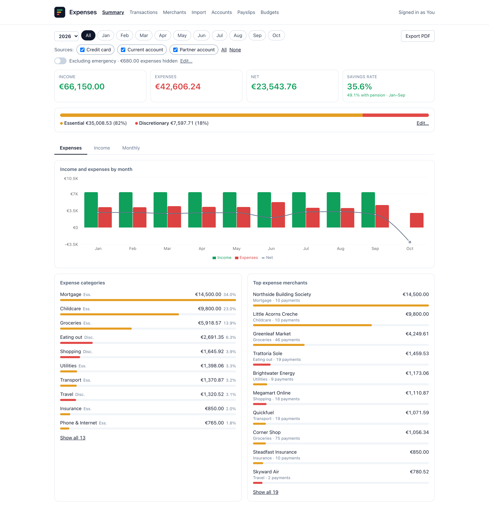
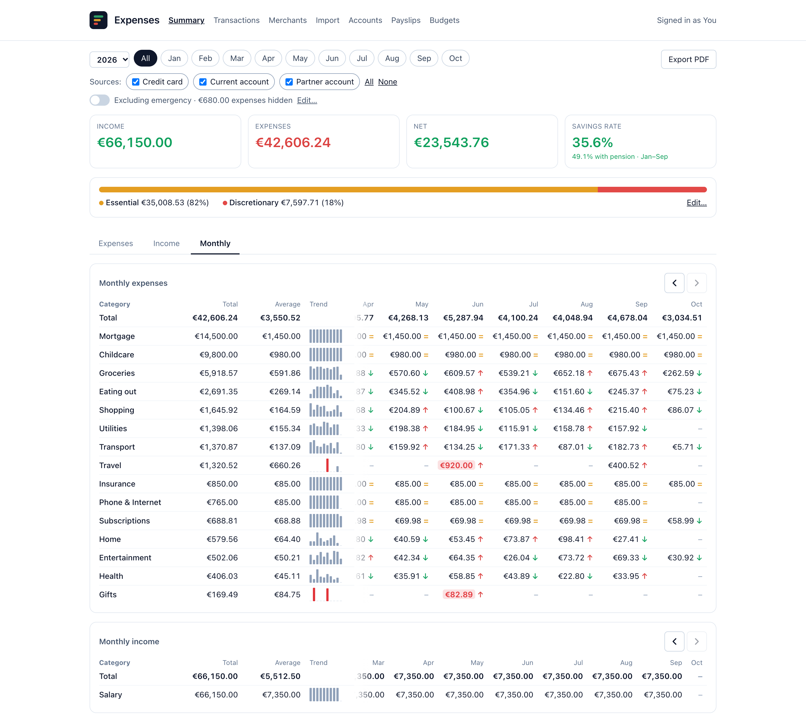
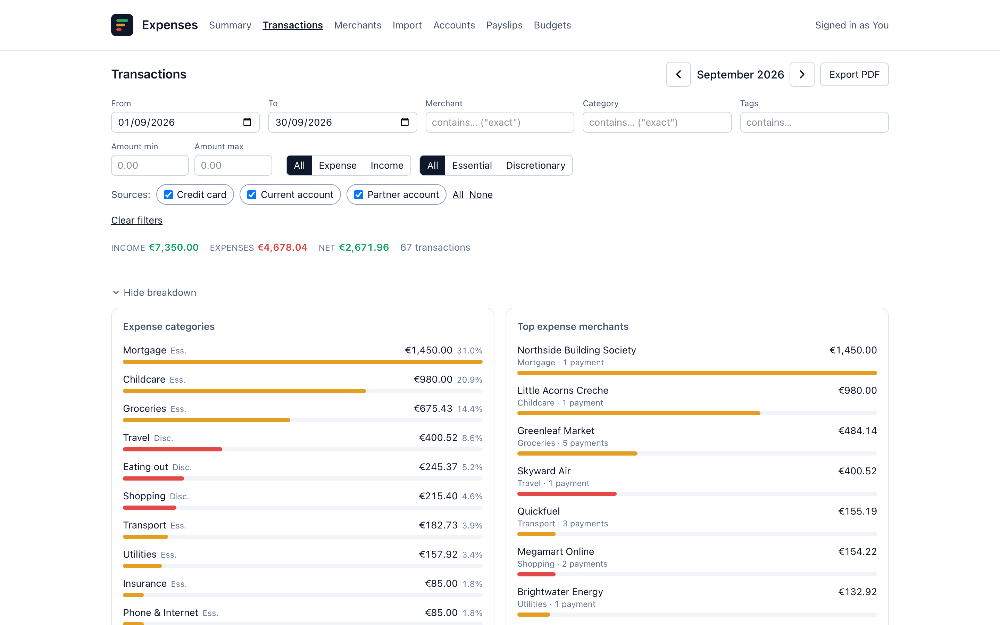
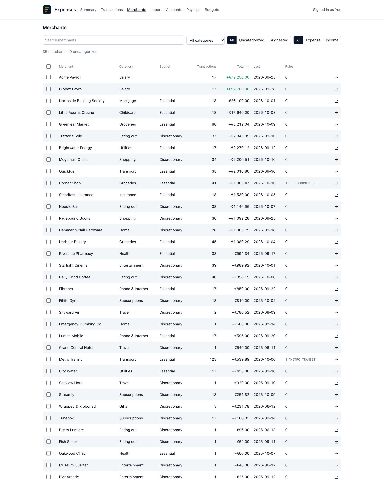
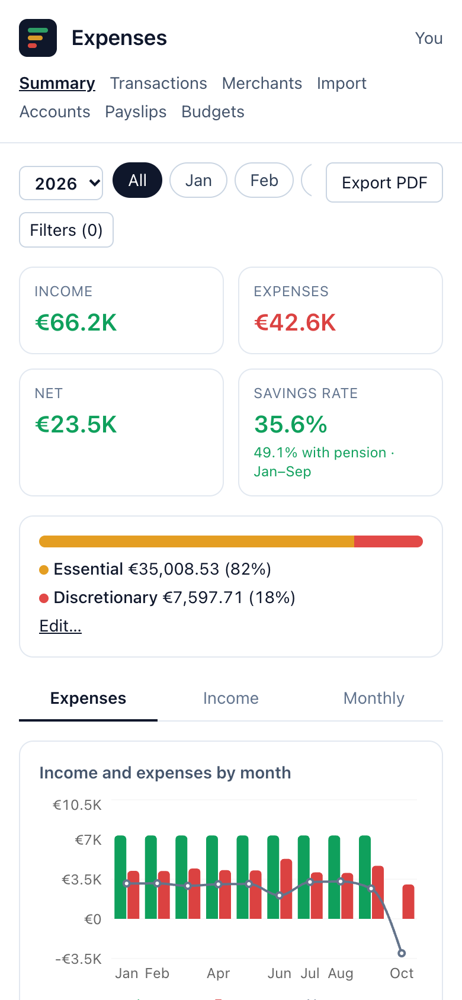
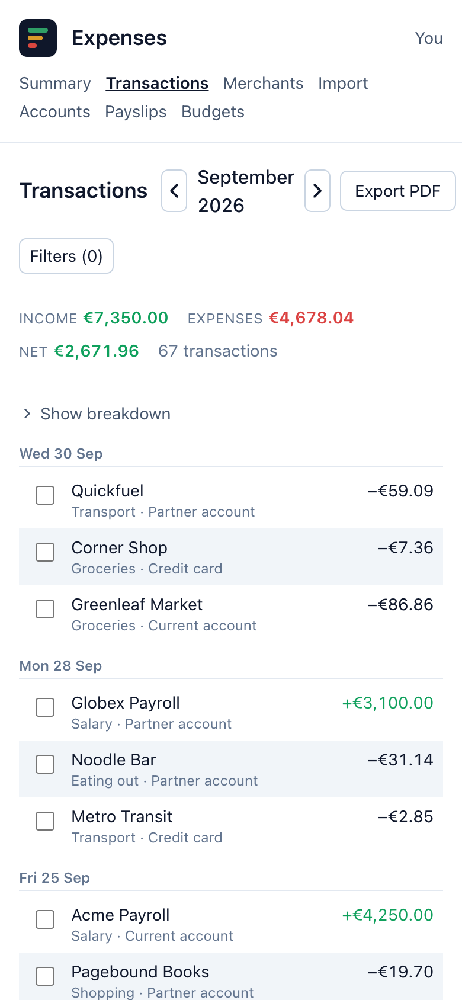

# Expense Analyzer

[](https://github.com/pallotron/expenses_analyzer/actions/workflows/tests.yml)
[](https://opensource.org/licenses/MIT)

A self-hosted household expenses app on Cloudflare Workers, D1 and Access.

## Story time

This project was born out of a combination of necessity and curiosity. After an injury left me with limited mobility and a lot of time on my hands, I found myself wanting to get a better handle on my expenses. I have multiple bank accounts, and I've always been frustrated by the subpar reporting and data export features they offer.

Even modern fintech apps like Revolut, which I love for many reasons, have their own quirks and limitations. For instance, their expense and cash flow reporting features are great, the integration with PTSB is ok and allows me to import the transactions into Revolut, but it's missing direct debits, and there's no sign of a fix in sight.

With my typing ability temporarily reduced, I needed a project that I could work on in short bursts, something that didn't require constant, strenuous typing. This seemed like the perfect opportunity to give "vibe coding" a try.

I decided to build a tool that would finally let me consolidate and analyze my expenses data in a way that made sense to me.

At the same time, I'd been wanting to learn [Textual](https://textual.textualize.io/), a TUI (Text User Interface) framework for Python. The idea of building a powerful, interactive, and terminal-based application was really appealing. So, I decided to combine these goals and create Expense Analyzer. It's a personal tool, born out of a specific set of circumstances, but I hope it can be useful to others who share my frustrations with personal finance management.

It's still a work in progress, but it should be useful enough for geeks like us.
Please contribute if you can or report bugs/issues!

Later the TUI grew into a web app, so the whole household can use it from any
device, phone included. Once the web app did everything the TUI did, the TUI
was retired. The last version with the TUI is
[`09b7f9a`](https://github.com/pallotron/expenses_analyzer/tree/09b7f9a).

## Features

- **Summary**: a year or a single month. Expenses, Income and Monthly tabs;
  cash-flow tiles with the savings rate; a monthly grid per category with
  trend arrows and anomaly highlights. Every number links to the transactions
  behind it.
- **Transactions**: filter by date range, merchant, category, tags, amount,
  type, budget type and source. Edit, re-categorise, tag or delete one row or
  many. An optional breakdown by category and merchant. Print or save the list
  as a PDF from the browser.
- **Merchants**: one category per merchant, and rules (regexes) that group
  statement lines under one merchant name, with a preview of what a rule would
  change. With a Gemini API key, Gemini suggests categories for uncategorised
  merchants and gives a second opinion on ones you pick.
- **Import**: CSV, XLS and XLSX bank exports, several files at once. Each
  source's column mapping is remembered, and re-importing a file adds nothing.
- **Budget types**: mark each category essential or discretionary, set an
  annual budget for each, and see the split on the Summary.
- **Payslips**: payslip PDFs are read in the browser and only the figures are
  saved. The Summary then shows a savings rate with pension next to the
  bank-only one.
- **Accounts**: say whose account each import source is, so a Summary filtered
  by source counts only the owners' pension.
- **Hidden tags**: tag patterns (`emergency`, `trip:*`) left out of the Summary
  totals, toggled from the Summary.

Guides: [Importing data](docs/IMPORTING_DATA.md) and
[Payslips and pension](docs/PAYSLIPS.md).

## Screenshots

All figures are from a made-up demo household (`make seed-demo`).

### Summary





### Transactions



### Merchants



### On a phone

<p>
  
  
</p>

## Running locally

No Cloudflare account is needed. You need Node 22 and `sqlite3`.

```sh
npm ci --prefix worker
npm ci --prefix frontend
make seed-demo   # wipes the local database and loads the demo household
make dev
```

Open <http://localhost:8787>. You are signed in as the demo user,
`you@example.com`. `make test` runs the Worker and frontend tests and builds
the frontend.

`worker/README.md` covers the rest: hot reload with Vite, keeping a second
local database with `PERSIST=<dir>`, and loading a copy of your own data.

## Self-hosting

See [worker/README.md](worker/README.md#deploying). You need:

- a Cloudflare account (the free plan is enough),
- a domain on Cloudflare for the Worker's custom domain,
- a Cloudflare Access application in front of it, with an Allow policy listing
  the household's emails.

Each person also needs a row in the `users` table with the same email. The
Worker trusts only the signed Access token, never a plain header.

## Analysing your data

`tools/snapshot.sh` copies the production D1 database into a local SQLite file
(default `~/.config/expenses_analyzer/snapshot.db`, never inside the repo). It
needs a logged-in `wrangler`. Query it with `sqlite3`:

- `v_transactions`: one row per live transaction, with date, merchant,
  category, tags and amount. The easiest place to start.
- `v_summary`: what the Summary totals, with hidden tags already left out.

`year` and `month` in `v_summary` are text: `'2026'` and `'2026-01'`.
`WHERE year = 2026` silently matches nothing; write `WHERE year = '2026'`.
Sum `amount_cents`, not `amount`.

```sh
sqlite3 ~/.config/expenses_analyzer/snapshot.db \
  "SELECT category, SUM(amount_cents) / 100.0 FROM v_summary
   WHERE year = '2026' AND type = 'expense' GROUP BY category ORDER BY 2 DESC;"
```

## Backups

D1 Time Travel keeps a restorable history of the database (7 days on the free
plan). Every deploy logs a restore point first. To go back:

```sh
cd worker
npx wrangler d1 time-travel info expenses       # current bookmark
npx wrangler d1 time-travel restore expenses --timestamp=<unix time or RFC 3339>
```

A restore also discards every write made since that point.

## Bank sync

Not yet. Transactions come in through Import. Syncing straight from the bank is
tracked in [#52](https://github.com/pallotron/expenses_analyzer/issues/52).

## License

MIT. See [LICENSE](LICENSE).
