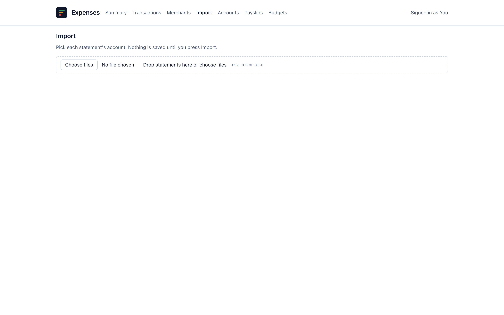

# Importing data

Transactions come in from your bank's exports: CSV, XLS or XLSX. Files are
parsed in your browser; only the rows are sent to the server.

To try it without your own data, use the synthetic exports in
[`examples/`](../examples):

- `bank_statement.csv`: separate "Money In" and "Money Out" columns, day-first
  dates.
- `credit_card.csv`: the same shape with a transaction and a posting date.
- `paypal.csv`: one signed amount column.
- `revolut.csv`: signed amounts, ISO dates, and a `State` column to filter on.

## The Import page

1. **Pick files.** Drop statements on the page or choose them. You can import
   several at once, for example a month's statements from every account.
2. **Choose a source per file.** The source is the account the file came from.
   Pick an existing one or "New source…" and name it. Once picked, the row
   shows the date of that source's latest transaction, so you can check the
   file starts where the last import stopped.
3. **Map the columns, once per source.** Say which columns hold the date, the
   merchant and the amount:
   - **Amount**: one signed column, or "Money in" plus "Money out" when the
     export splits them.
   - **Type**: from the sign (negative is an expense), or everything an expense,
     or everything income. Ignored when there is a "Money out" column.
   - **Date order**: day first (01/09 is 1 September) or month first.
   - **Header row**: found from the column names; pin it if the export has
     lines above the header.
   - **Only import rows where** (optional): for example `State` is `COMPLETED`
     in a Revolut export.

   The mapping is saved with the source after a successful import. Next time,
   a file for that source needs no mapping.
4. **Preview.** Each file is checked with a dry run that writes nothing. Its
   row shows how many transactions are new and how many are already there, and
   the parsed preview shows the rows as they will be saved. Rows that could not
   be read are listed as skipped.
5. **Import.** One button imports every ready file. Keep the page open until it
   finishes. The result table shows, per file, what was imported, what was
   already there, and what matched a transaction you deleted.

## Duplicates

A transaction is identified by its date, merchant and amount. The source does
not count, so the same purchase seen by two accounts is one purchase.

- Re-importing a file adds nothing, so overlapping exports are safe.
- Two identical transactions in one file (two coffees on one day) are kept as
  two.
- A transaction you deleted stays deleted when the file is imported again.

A single file can hold up to 5,000 rows; split larger exports.

## Categories

New merchants arrive uncategorised. If the server has a Gemini API key, tick
**Suggest categories for new merchants** before importing. Gemini's
suggestions are saved flagged, and **Review suggestions** opens the Merchants
page to confirm or change them. Without Gemini, set categories on the Merchants
page yourself.

## Bank sync

Not available yet: see
[issue #52](https://github.com/pallotron/expenses_analyzer/issues/52).
