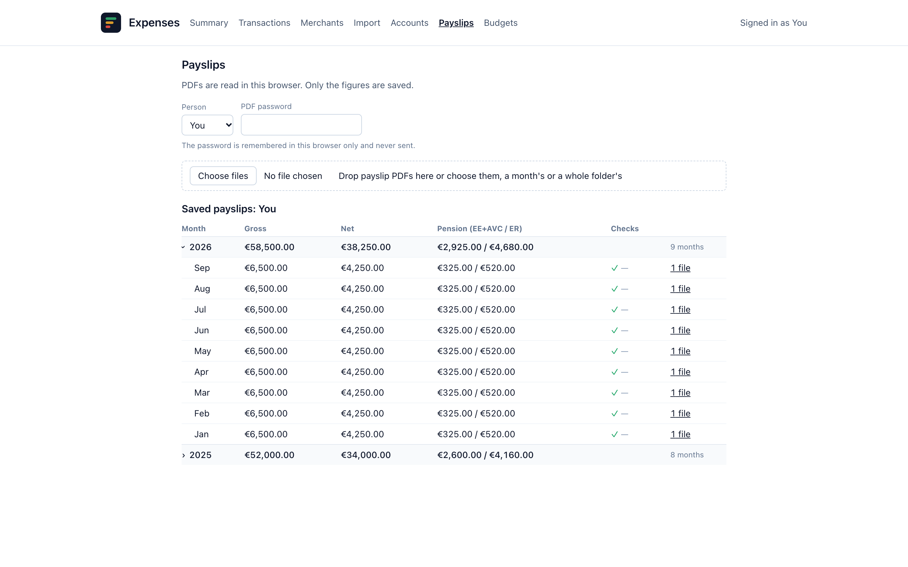

# Payslips and pension

Bank data alone understates how much you save: pension contributions are taken
out before your salary reaches the bank, so they never show up there. The
Payslips page reads your payslip PDFs, records the pension figures, and the
Summary then shows a savings rate with pension next to the bank-only rate.



## How it works

1. Open **Payslips** and pick the **Person** the payslips belong to. The people
   are the household's users.
2. If the PDFs are password-protected, type the password. It is remembered in
   this browser only and never sent; **Forget** clears it.
3. Drop the PDFs on the page, or choose them: one month's or a whole folder's.
4. Each file is read in the browser with pdf.js. Its row says what was found:
   new, replaces a saved copy, needs a password, layout not recognised, or no
   month in the file name.
5. **Import** sends only the figures (gross, net, pension) for the ready files.
   The PDFs never leave your device.

Saved payslips are listed below, by year and month, with gross, net and
pension.

## File names

- The month comes from the file name, which must contain `YYYY-MM` somewhere
  (for example `payslip-2026-01.pdf`).
- Names containing `draft`, `old` or `wrong` are left out, so a corrected
  payslip can replace a bad one. Each such row has a button to import it
  anyway.
- Importing a file with the same name as a saved one replaces it, so
  re-importing a folder is safe.
- Several PDFs for one month (a bonus or supplementary run) are added together.

## Checks

- **Year-to-date pension**: each month's pension is checked against the
  payslip's year-to-date figure. A mismatch is flagged with a warning rather
  than trusted. A drop in year-to-date is read as a new employer, not an error.
- **Net pay**: the net worked out from the line items is checked against the net
  the payslip states. They differ when the payslip has a line the parser does
  not know, and the month is flagged.

## Supported layout

Only the **Irish PAYE** payslip layout. Labels are matched case-insensitively,
so providers that differ only in wording share one parser. A payslip in another
layout is reported as "Layout not recognised" and not imported.

## Owners and the Summary

The **Accounts** page says whose account each import source is ("No one" for a
shared account). When the Summary is filtered by source, only the pension of
those accounts' owners is counted. Unfiltered, everyone's pension counts.

Only pension is added, never a second salary. This assumes everyone's take-home
pay already lands in the accounts you import, so their net pay is in the bank
figures and only the pension is missing.

## Savings rate

The rate with pension uses the same base as the bank-only rate, with pension
added to both sides, so the two are directly comparable:

```
pension             = employee pension + AVC + employer pension
saved_with_pension  = (bank income - bank expenses) + pension
income_with_pension = bank income + pension

Savings rate (bank only)    = (bank income - bank expenses) / bank income
Savings rate (with pension) = saved_with_pension / income_with_pension
```

Only months that have both a payslip and bank transactions count, so a partial
year is not compared with a full year of bank data. The Summary says which
months are covered, for example "Jan–Mar".

## Privacy

Payslip PDFs are parsed in your browser. Only the numbers are uploaded. The PDF
password stays in the browser.
